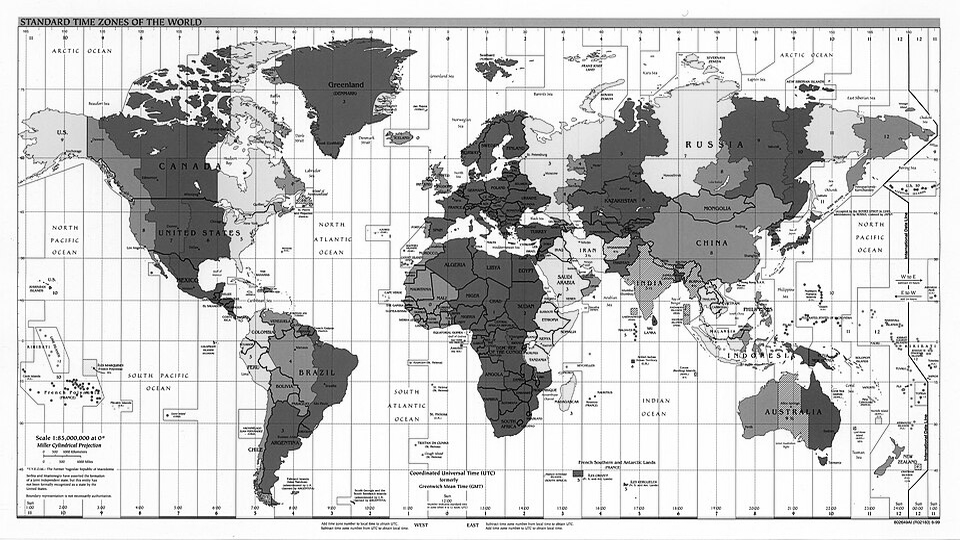

# LilyGo EPD 4.7" Callsign Display

Amateur radio callsign display for LilyGo T5 4.7" e-paper display (non-touch version).

## Features

- **Large callsign letters** - 4-6 characters, auto-sized to fill screen
- **World timezone map** - Secondary screen with world map
- **Web configuration** - Configure via WiFi AP, no recompilation needed
- **BOOT button navigation** - Toggle screens with physical button
- **Deep sleep** - Battery-friendly operation with configurable sleep interval
- **No touch required** - Works with non-touch LilyGo T5 4.7" S3

## Hardware

**Required:** LilyGo T5 4.7" S3 (ESP32-S3, 960x540 e-paper)

The display does NOT require touch capability - navigation uses the BOOT button.

## Quick Start

### 1. Upload Firmware

**Arduino IDE Settings:**
| Setting | Value |
|---------|-------|
| Board | ESP32S3 Dev Module |
| USB CDC On Boot | Enable |
| Flash Size | 16MB (128Mb) |
| Partition Scheme | 16M Flash (3M APP/9.9MB FATFS) |
| PSRAM | OPI PSRAM |
| Upload Mode | UART0/Hardware CDC |

**Required Libraries:**
- Board Manager: esp32 by Espressif Systems 2.0.17
- EPD47-master: https://github.com/DFRobotdl/EPD47/archive/refs/heads/master.zip

### 2. First Boot Configuration

On first power-up, the device automatically enters configuration mode:

1. Connect to WiFi network: `Callsign-Setup`
2. Password: `callsign123`
3. Open browser: `http://192.168.4.1`
4. Enter your callsign and info
5. Click Save - device restarts with your callsign

### 3. Normal Operation

After configuration, the device displays your callsign and enters deep sleep.

## Navigation

| Action | Result |
|--------|--------|
| **Press BOOT** (short) | Toggle between Callsign and World Map |
| **Hold BOOT** (3 sec) | Enter configuration mode (WiFi AP) |
| **Press RST** | Restart device |

## Configuration Options

| Field | Description | Example |
|-------|-------------|---------|
| Callsign | 4-6 characters (A-Z, 0-9) | XE1ABC |
| Line 1 | Name or first subtitle line | John Smith |
| Line 2 | Location, grid locator, etc. | Mexico City - EK09 |
| Sleep interval | Minutes between display refreshes | 60 |

## Screens

### Callsign Screen
Large vector-drawn letters showing your callsign with subtitle lines below.

### World Map Screen
Full-screen world timezone map showing all time zones.

## Troubleshooting

### Upload fails
1. Press and hold BOOT button
2. While holding BOOT, press RST
3. Release RST, then release BOOT
4. Upload should now work

### Can't connect to configuration WiFi
- Make sure no other device is connected to `Callsign-Setup`
- Try moving closer to the device
- Press RST to restart and try again

### Display shows "CALL" instead of my callsign
- Device hasn't been configured yet
- Hold BOOT for 3 seconds to enter configuration mode

## Files

| File | Description |
|------|-------------|
| `LilyGo-EPD-4-7-Callsign-Display.ino` | Main sketch |
| `callsign.h` | Large letter drawing functions |
| `worldclock.h` | World map display |
| `worldmap_data.h` | World map bitmap data |
| `opensans*.h` | Font files |

## Technical Details

- **Display:** 960x540 pixels, 4-bit grayscale
- **MCU:** ESP32-S3 with PSRAM
- **Power:** Deep sleep between refreshes (~10uA)
- **Storage:** Configuration saved in ESP32 NVS (persists across power cycles)
- **Wake sources:** BOOT button or timer

## License

MIT License - See LICENSE file

## Credits

- LilyGo for the excellent e-paper hardware
- EPD47 library by Vroland
- World timezone map from public domain sources

---

73 de XE1E
